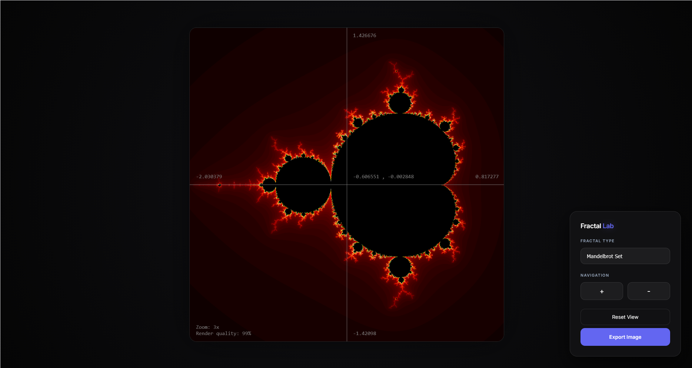
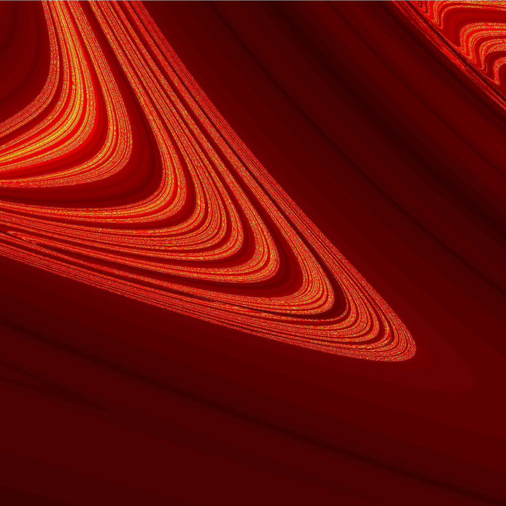
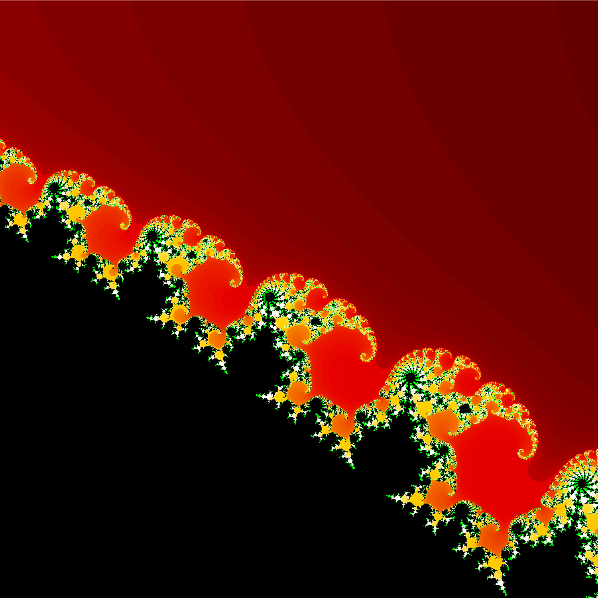
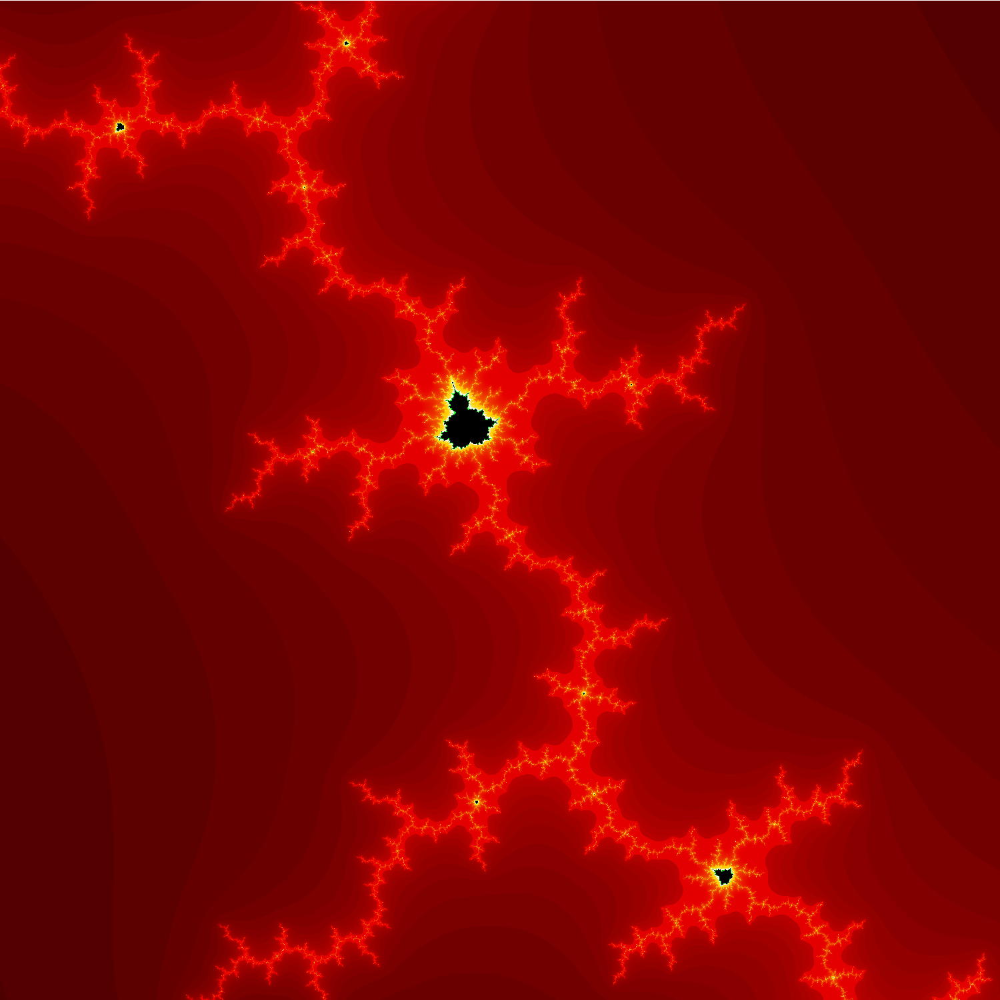
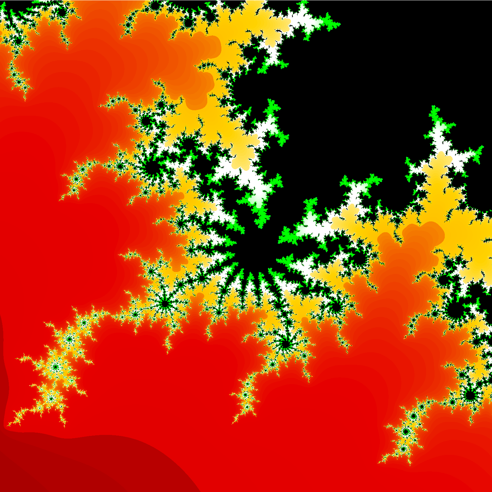
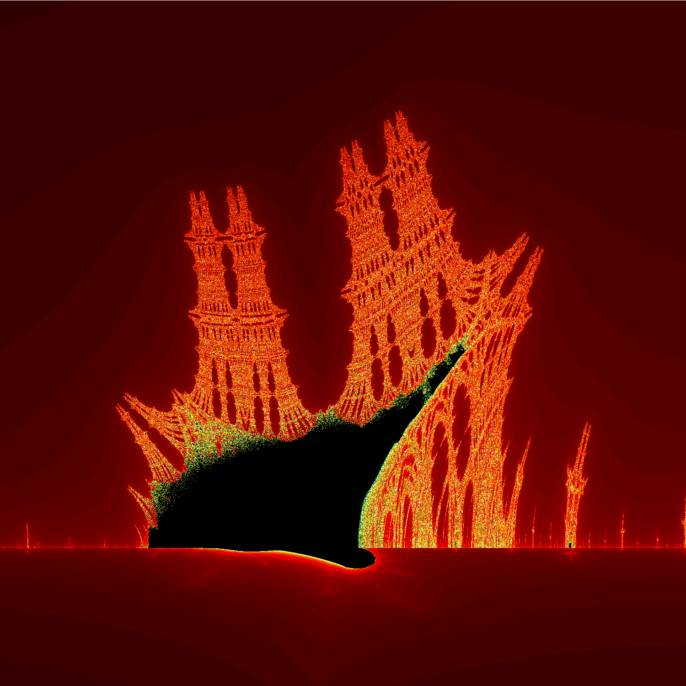
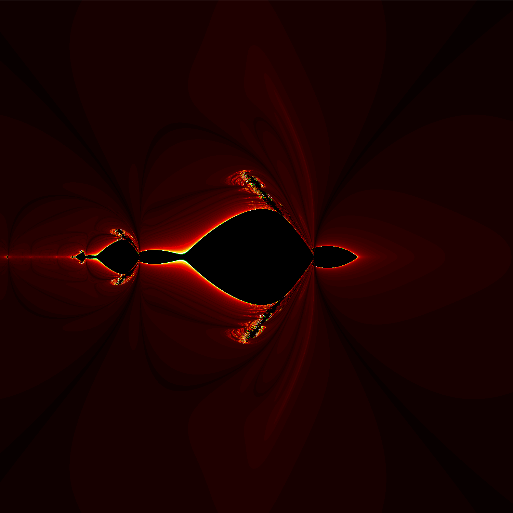

# Fractal Lab 🌌

Fractal Lab is an interactive fractal explorer built with HTML, CSS, and JavaScript. It allows you to explore multiple fractals like the **Mandelbrot set**, **Burning Ship**, and a custom **Turtle** shaped fractal I found while making this project.



---

## Features

* Explore **Mandelbrot**, **Burning Ship**, and **Turtles** fractals
* Smooth **zoom** and **pan** navigation
* Adjustable rendering **quality**
* Export **high-resolution screenshots**
* Uses **Web Workers** for fast, non-blocking fractal generation
* Responsive design, works on desktop and mobile

---

## Gallery
<div style="display: flex; flex-wrap: wrap; gap: 10px; justify-content: center;">
  
  
  
  
  
  
</div>

*Images generated with Fractal Lab.*

---

## Installation & Usage

> **Note:** Because this project uses **Web Workers**, it cannot be run by just opening the `index.html` file in your browser. You need to run it on a **local server**.

### Steps

1. **Clone the repository**

   ```bash
   git clone https://github.com/J19721972/Fractal-Lab
   cd fractal-lab
   ```

2. **Start a local server**
   You have multiple options:

   * **VSCode Live Server extension** (recommended)
   * Python 3 server:

     ```bash
     python -m http.server
     ```
   * Node.js server:

     ```bash
     npx serve .
     ```

3. **Open the project in your browser**

   * If using Live Server, click **Go Live**
   * Otherwise, go to `http://localhost:8000` (or the port your server uses)

4. **Enjoy exploring fractals!**

---

## Controls

* **Fractal Type:** Select which fractal to display
* **Zoom In / Out:** Use the `+` and `-` buttons or mouse wheel
* **Pan:** Click and drag the fractal
* **Reset View:** Reset zoom and offsets
* **Export Image:** Save a high-resolution PNG of the current view (NOTE: this feature works a bit slow at the moment so it tends to take time to render and download the image)
